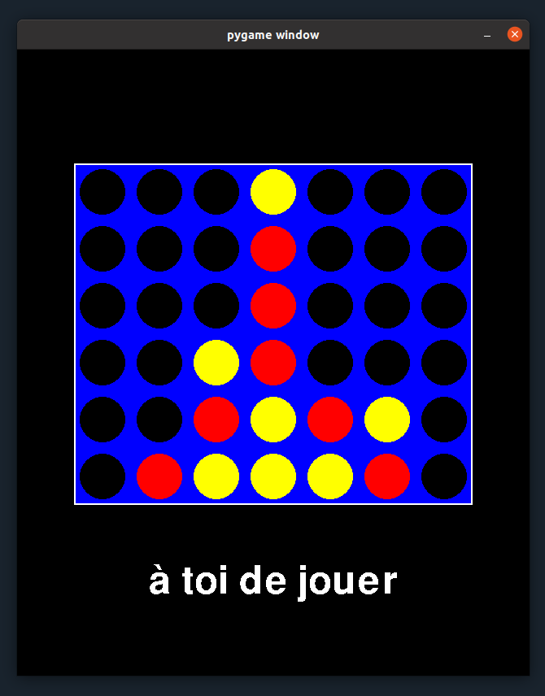

# Power 4 game with pygame

Power 4 game developped in Python:
- Display pygame library
- Min-Max algorithm for the bot, simulating several moves in advance
- Tunable grid size
- Written and tested with Python 3.7

# Web version

Now available at [gkcb.fr/pywer4](gkcb.fr/pywer4) (when the server is up)

